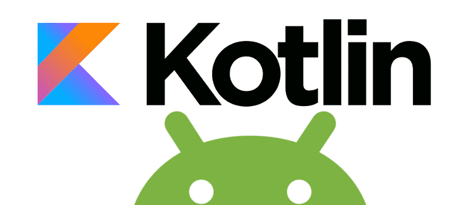

# Kotlin Android Basics

Ejemplos para usar Kotlin a nivel básico para el desarrollo de aplicaciones Android.

- [Kotlin Android Basics](#kotlin-android-basics)
  - [Acerca de](#acerca-de)
  - [Lección 1: Compila tu primera app](#lección-1-compila-tu-primera-app)
  - [Lección 2: Diseños](#lección-2-diseños)
  - [Lección 3: Navegación](#lección-3-navegación)
  - [Autor](#autor)
    - [Contacto](#contacto)
  - [Licencia](#licencia)

## Acerca de
Los siguientes proyectos muestran como usar Kotlin para aplicaciones Android en modo básico siguiendo los code examples de[ Android Jetpack de Google](https://developer.android.com/courses/kotlin-android-fundamentals/toc).

## Lección 1: Compila tu primera app
En la Lección 1, aprenderás a configurar Android Studio para usar Kotlin y a compilar apps. Comenzarás con "Hello World" y avanzarás hacia una app que utiliza archivos de imagen y un controlador de clics. Aprenderás cómo se estructuran los proyectos de Android, cómo usar y modificar vistas en tu app de Kotlin para Android, y cómo asegurarte de que tus apps admitan retrocompatibilidad. También aprenderás sobre los niveles de API y las bibliotecas de Android Jetpack.

## Lección 2: Diseños
En la Lección 2, aprenderás a usar el editor de diseño de Android Studio para crear diseños lineales y de restricciones. Crearás apps que obtengan y muestren entradas del usuario, que respondan a los toques de los usuarios y que cambien la visibilidad y el color de las vistas. En esta lección, también se explica cómo usar la vinculación de datos para eliminar llamadas ineficientes con el método findViewById().

## Lección 3: Navegación
En la lección 3, aprenderás a crear una navegación útil en una app. Crearás un fragmento, lo agregarás a una app y, por último, agregarás la navegación a la app con el gráfico de navegación de Android Studio. Agregarás un panel lateral de navegación y un menú de opciones a tu app, y trabajarás con la pila de actividades, cambiando el destino del botón Atrás del sistema. Por último, aprenderás a invocar una actividad externa desde la app.

## Autor

Codificado con :sparkling_heart: por [José Luis González Sánchez](https://twitter.com/joseluisgonsan)

### Contacto

  Cualquier cosa que necesites házmelo saber por si puedo ayudarte 💬.

     &nbsp;&nbsp;
     &nbsp;&nbsp;
      &nbsp;&nbsp;
    

## Licencia

Este proyecto está licenciado bajo licencia **MIT**, si desea saber más, visite el fichero [LICENSE](./LICENSE) para su
uso docente y educativo.
